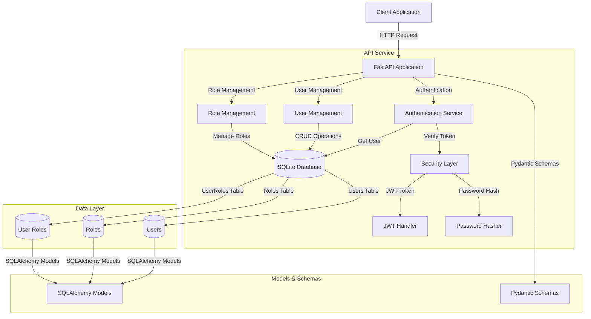

# OAuth2 Authorization Server

A FastAPI-based OAuth2 authorization server that handles user authentication, token issuance, and access policy enforcement.

## Architecture



## System Components

1. **API Layer**
   - FastAPI application handling HTTP requests
   - Route handlers for authentication, users, and roles
   - Request/response validation using Pydantic schemas

2. **Security Layer**
   - JWT token generation and validation
   - Password hashing with BCrypt
   - Role-based access control (RBAC)

3. **Data Layer**
   - SQLite database for persistent storage
   - SQLAlchemy ORM for database operations
   - Three main tables: Users, Roles, and UserRoles

4. **Models & Schemas**
   - SQLAlchemy models for database operations
   - Pydantic schemas for request/response validation
   - Data transformation and validation logic

## Features

- User authentication with username/password
- JWT token generation and validation with timezone-aware expiration
- Role-based access control (RBAC) with eager loading
- SQLite database backend with absolute path configuration
- Password hashing using passlib with bcrypt
- Comprehensive test suite with pytest
- Poetry dependency management
- API documentation with OpenAPI/Swagger
- Pydantic v2 schemas with field validation

## Installation

1. Make sure you have Poetry installed:
```bash
pip install poetry
```

2. Install dependencies:
```bash
poetry install
```

3. The database file (`auth.db`) will be automatically created in the `Authentication-Authorization` directory when you first run the server.

## Running Tests

Run the full test suite:
```bash
poetry run pytest
```

Run specific tests:
```bash
poetry run pytest tests/test_auth.py
poetry run pytest tests/test_users.py
poetry run pytest tests/test_roles.py
```

Run tests with verbose output:
```bash
poetry run pytest -v
```

## Usage

Start the server:
```bash
poetry run start
```

The server will be available at `http://localhost:8000`. You can access the interactive API documentation at `http://localhost:8000/docs`.

## API Endpoints and Examples

### Authentication

#### Get Access Token
```bash
curl -X POST "http://localhost:8000/auth/token" \
  -F "username=your_username" \
  -F "password=your_password"
```

### Users

#### Create New User
```bash
curl -X POST "http://localhost:8000/users/" \
  -H "Content-Type: application/json" \
  -d '{
    "username": "newuser",
    "email": "newuser@example.com",
    "password": "strongpassword",
    "roles": ["user"]
  }'
```

#### List All Users (Admin Only)
```bash
curl -X GET "http://localhost:8000/users/" \
  -H "Authorization: Bearer your_access_token"
```

#### Get Current User Info
```bash
curl -X GET "http://localhost:8000/users/me" \
  -H "Authorization: Bearer your_access_token"
```

#### Get Specific User Info (Admin or Self)
```bash
curl -X GET "http://localhost:8000/users/username" \
  -H "Authorization: Bearer your_access_token"
```

#### Update User (Admin or Self)
```bash
curl -X PUT "http://localhost:8000/users/username" \
  -H "Authorization: Bearer your_access_token" \
  -H "Content-Type: application/json" \
  -d '{
    "email": "newemail@example.com",
    "password": "newpassword",
    "is_active": true
  }'
```

#### Delete User (Admin Only)
```bash
curl -X DELETE "http://localhost:8000/users/username" \
  -H "Authorization: Bearer your_access_token"
```

### Roles

#### Update User Roles (Admin Only)
```bash
curl -X PUT "http://localhost:8000/roles/username" \
  -H "Authorization: Bearer your_access_token" \
  -H "Content-Type: application/json" \
  -d '{
    "roles": ["admin", "user"]
  }'
```

## Response Examples

### Successful Authentication
```json
{
  "access_token": "eyJhbGciOiJIUzI1...",
  "token_type": "bearer"
}
```

### User Response
```json
{
  "id": 1,
  "username": "user123",
  "email": "user@example.com",
  "is_active": true,
  "roles": ["user", "admin"]
}
```

### Error Response
```json
{
  "detail": "Error message here"
}
```

## Role-Based Access Control

The server implements role-based access control with the following default roles:
- `admin`: Full access to all endpoints
- `user`: Access to personal information and limited operations
- `manager`: Custom role for specific access patterns

Certain operations require specific roles:
- Listing all users: Requires `admin` role
- Updating user roles: Requires `admin` role
- Deleting users: Requires `admin` role
- Updating user information: Requires `admin` role or self-modification
- Viewing user details: Requires `admin` role or self-viewing

## Development

To run the server in development mode with auto-reload:
```bash
poetry run start
```

## Security Notes

- In production, replace the default secret key with a secure one (use environment variables)
- Use HTTPS in production
- Implement rate limiting for production use
- Consider adding password complexity requirements
- Review and adjust token expiration times as needed (currently 30 minutes)
- Database uses absolute path to prevent duplicate database files
- Password hashing uses passlib with bcrypt for secure storage
- JWT tokens are timezone-aware using UTC timestamps

## Recent Updates

### Version 0.1.0 (Latest)
- Fixed all test failures related to authentication and authorization
- Updated to timezone-aware datetime handling (`datetime.now(timezone.utc)`)
- Improved role verification with proper eager loading using SQLAlchemy's `joinedload`
- Fixed Pydantic v2 schema validation for Role objects with `field_validator`
- Centralized authentication with `get_current_user` dependency
- Fixed database path to use absolute path (prevents multiple database files)
- Suppressed passlib bcrypt version compatibility warnings
- Added comprehensive test coverage for all endpoints
- Updated to Pydantic v2 with `ConfigDict` and modern validators

## Project Structure

```
Authentication-Authorization/
    auth.db                # SQLite database (auto-created on first run)
    pyproject.toml         # Poetry dependencies and project configuration
    poetry.lock            # Locked dependency versions
    README.md              # This file
    auth_server/
        __init__.py
        main.py            # Application entry point
        database/          # Database configuration and sessions
            __init__.py
            db.py          # SQLAlchemy setup with absolute path
        security/          # Security and authentication
            __init__.py
            auth.py        # JWT, password hashing, current user dependency
        models/            # SQLAlchemy models
            __init__.py
            role.py        # Role model
            user_role.py   # User-Role association table
            user.py        # User model with hybrid properties
        routers/           # API routes
            __init__.py
            auth.py        # Token generation endpoint
            roles.py       # Role management endpoints
            users.py       # User CRUD endpoints
        schemas/           # Pydantic v2 schemas
            __init__.py
            role.py        # Role schemas
            user.py        # User schemas with field validators
    tests/                 # Test suite
        __init__.py
        test_main.py       # Test setup and fixtures
        test_auth.py       # Authentication tests
        test_users.py      # User endpoint tests
        test_roles.py      # Role endpoint tests
```

## Support & Contact

For support requests, bug reports, or feature suggestions, please contact:

### Technical Support
- Email: v.cse59@gmail.com
- Response Time: 24-48 hours
- Hours: Monday-Friday, 9:00 AM - 5:00 PM (UTC)

### Security Issues
For security-related concerns or vulnerability reports:
- Email: v.cse59@gmail.com

### Documentation
For documentation improvements or suggestions:
- GitHub Issues: [Create an issue](https://github.com/your-organization/auth-server/issues)
- Documentation Wiki: [Auth Server Wiki](https://github.com/your-organization/auth-server/wiki)

### Commercial Support
For enterprise support and custom development:
- Email: v.cse59@gmail.com